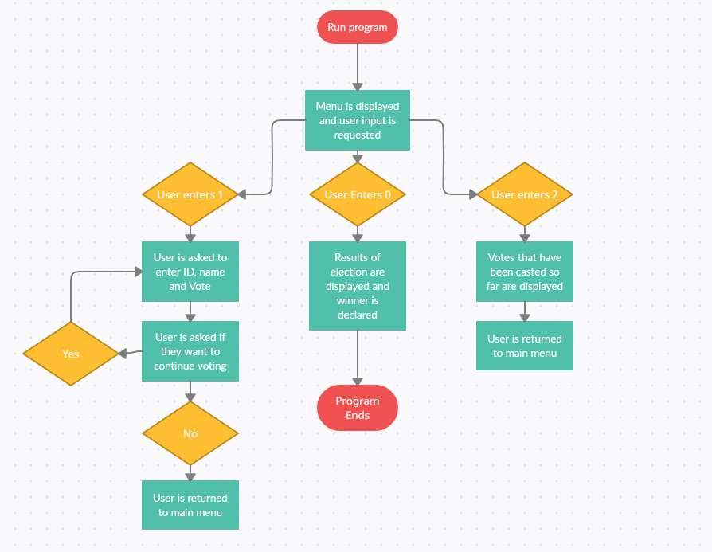

# Report by Kai'lani Woodard, zackery devers

## Introduction and Motivation

What is the concept behind your project? How does it satisfy the two broad requirements on this assignments? Discuss briefly
how your concept is motivated by the cryptocurrency-related technology and what existing or potential solutions might it provide to our challenges?

Our concept for this project was to code a blockchain based voting machine. Features of this voting machine includes being easy-to-use and anonymous voting for the user. Our use of a blockchain data structure relates us to the concept of cryptocurrency-related technology. This helps solve the problem that society recently went through with the most recent election. In said election, our former president claims there to be an abundance of voter fraud. Even though said voter fraud might not have taken place, our prototype for a better voting system that can help prevent said claims from even occurring.

## Design of your Project

This section should provide detailed description of your design. Please include a visual representation of the design of your project. This could include a technical diagram or a flowchart demonstrating how your concept works, a walk through a conceptual example, etc.



To better explain the flowchart we have to break it down into its individual steps. The user starts by running the program via "java Main". You are then prompted with a menu requesting the users response of either 0, 1, or 2. If the user chooses 0 the program displays who won the election and ends the program. If they are to choose 1; they are prompted with their name, their voter id, and who they are going to vote for. After this step the program asks whether they want to continue voting. If yes the loop repeats itself, if no then the user is returned to the main menu. The final option they can choose is 2. If the user choses 2 the votes that have been casted already are displayed and the user is returned to the main menu.

## Implementation

This section should describe implementation details of your project (how you implemented your solution). Please describe which languages, libraries, external tools you used. This section should also provide commands (in code blocks) that are needed to run your implementation and what is needed to be installed beforehand.

We decided to program our project in Java because we all have a good familiarity with the language and also because of its object-oriented nature. Our program is fairly simple, therefore we felt that in order to create the best program possible that using a language that we are all familiar with was the best and most efficient method of achieving the project.

In order to implement our solution, we first constructed the Block class which also has the Vote class nested inside of the Block class. Both of these classes import Serializable in order to give the ability for objects to be represented as a sequence of bytes including the object’s data as well as information regarding its type and types of data stored in the object. The Vote class has a series of accessor and mutator methods to modify and access each element of a vote, that being `voterName`, `voterID`, and `voteParty` while the Block class takes each of these elements and collates them into a vote accompanied with a previous hash or in this case `previousHash`. The Block class then has methods to access and modify the `previousHash` and `blockHash`, along with the method `toString()` which is used to display output of the blockchain data to the terminal.

Next, we constructed the Main class to bear the majority of the code that gets out program to function. The Main class begins by asking the user for input to decide which action they would like to take. The beginning menu only has two options, which are casting votes or viewing the votes on the blockchain. From there, the program creates several data structures with different purposes; `hashVotes` is a HashSet that contains each voter ID to ensure there are no repeated votes, `blockList` is an ArrayList that contains each of the blocks, which in this case are the votes. From there, we add the first block to the program, the Genesis Block, mainly to pay homage to the first Bitcoin ever mined. From there, we created an ArrayList named `candidates` to store each of the candidate names in and add each of those to the ArrayList. We then provide options through a series of if statements where the user can either: cast a vote, view votes on the blockchain, or exit the program. At the program's conclusion, the results of the election are displayed and the program thanks the user for using our program. The Main class also contains the methods `checkValidity(Block b, HashSet hv)` and `menuDisplay(boolean first)` to check the validity of a vote and display the menu that the user sees because that occurs several times throughout the program.

Regarding importing external libraries, we had to import Java packages in order for our program to function correctly. The two packages we imported were java.util.* and  java.io.Serializable. We chose to install all of the components of the java.util package because of our use with several of the interfaces within it, including ArrayList, HashSet, and Scanner.

For our program to work correctly on your machine you need to have Java jdk1.8 or newer in order for the voting machine to be able to run.

In order to run the program, you would navigate to the `src` directory and run the following commands in your terminal.

```
javac Main.java
java Main
```

## Evaluation and Testing

This section should concentrate on how you conducted evaluation of your solution. You should test your implementation with different inputs (at least ten, if it makes sense) to verify its correctness, efficiency, effectiveness, etc. as appropriate for your project. Please include the input and a sample output in code blocks or indicate where these inputs/outputs are located  (as appropriate given your implementation). Automated testing is preferred but manual testing is acceptable. You must describe the type of testing that have been done and include the output of test cases in code blocks if appropriate.

## Description of the challenges that you faced and how you resolved them

In our original implementation, we intended for each vote to be encrypted and then decrypted when displaying the votes on the blockchain. Unfortunately, in our merits to achieve this we had come up with failure each time. To our dismay, our solution to this problem was removing the function of encrypting and decrypting from the program completely as each attempt at implementation was non-functional.

However, this fortunately paved the way for making programming much easier for the rest of the project.

## If worked in a team, description of the way in which you and your team members shared the project work

Zackery Devers- for my portion of the project I focused more on the presentation rather then the coding due to the time difference. My partners got a lot of the base coding done while they had the allotted time to do so in class so they left minor problems and bugs to fix if they couldn't figure out the solution to them. We really focused on making sure everyone was involved with the allotted problem occurring from time zone difference. I also managed what was on the final report for our group.

Robert McMaster- Over the course of this project I primarily worked on the design and debugging of Main.java. I also helped design the user interface of the program, specifically the main menu. While working on this portion, my goal was to make it as user friendly as possible, which I believe I achieved. There were various bugs that came up, one being an issue with the voter name not being saved to the blockchain. After doing some research I was able to figure out why this was happening and I fixed the issue. The sections that I did implement I did so through Teletype, which was the software that allowed us to all work on code at the same time. I was also involved in the creation and presentation of the slides that were used at various times over the course of this project.

Kai'lani Woodard- For my contributions for the project, I primarily focused on the construction of the Block class as well as creating the essential functionality for the Main class. This is heavily reflected through my commit history, which is listed under a combination of such under the alias 'kailaniwoodard' and 'Kai'lani Woodard'. Some specificities of my contributions within the Main class include but are not limited to the initialization of lists, sets, and other various variables in the beginning of the program, development of the code within the program's do-while loop which runs the voting machine, the vote counting functionality, and the creation of the `validateChoice()` method. Of course, commits can not necessarily be fully reliable to reflect the amount of work each member put into the final project, as I often used teletype collaboratively with Zack while programming and debugging. I also took responsibility to comment all of the code as descriptively as possible. Finally, I also worked collaboratively with Zack through teletype to work on developing testing.
